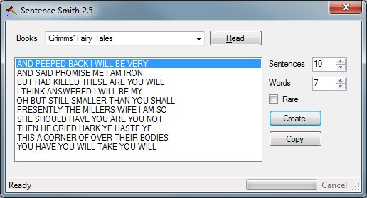

Book Smith
----------

*aka Sentence Smith 2.5*

The following is from a Facebook post of mine on [March 20, 2012](https://www.facebook.com/photo.php?fbid=10150590433617483&set=a.492798267482.265990.688612482&type=3&theater).

>  Last year I made a program to create a random list of words. I've expanded upon it to create a random list of sentences in a similar manner based on patterns found in books to get a sense of inspiration. So far most information looks silly - grammar and sentence structure are bad. I need to start looking into different types of sentence structure and identifying types of words to increase my chances to get something that makes sense. Project Gutenberg has many books to choose from as text files. None of the sentences generated appear in the books themselves. I may set it up so that no more than a certain number of words may appear in successive order to avoid plagiarism. However, it brings a question up - can copying style and use of words be considered as plagiarism?

